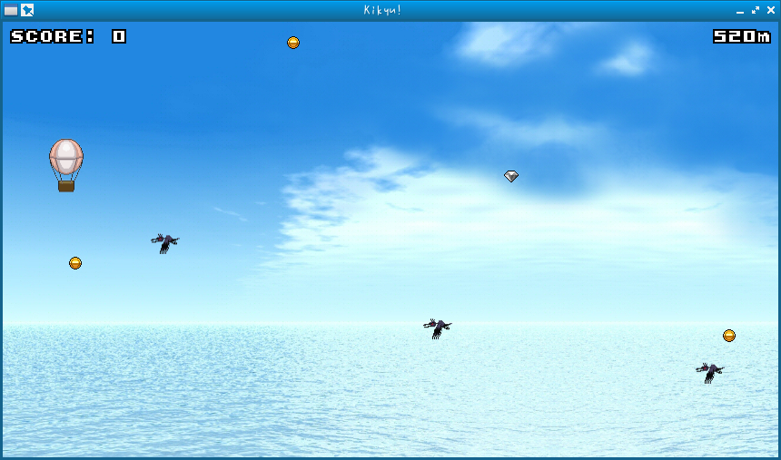
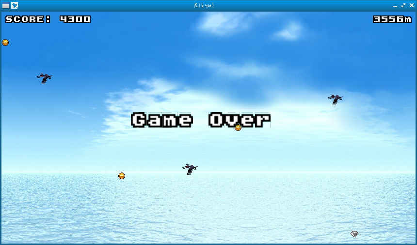

# Kikyu!

a game using catcake





## How to use

```bash
$ clang++ -o kikyu kikyu.cpp -Iinclude -Llib.x86_64 -lcatcake -lasound -lmad -lfreetype -lpng -ljpeg -lz -lGL -lpthread -lX11 -lXxf86vm
$ ./kikyu
```

## Other versions

- https://github.com/yui0/Kikyu-SoftPixel
- https://github.com/yui0/catgl/tree/master/sample/Kikyu!
